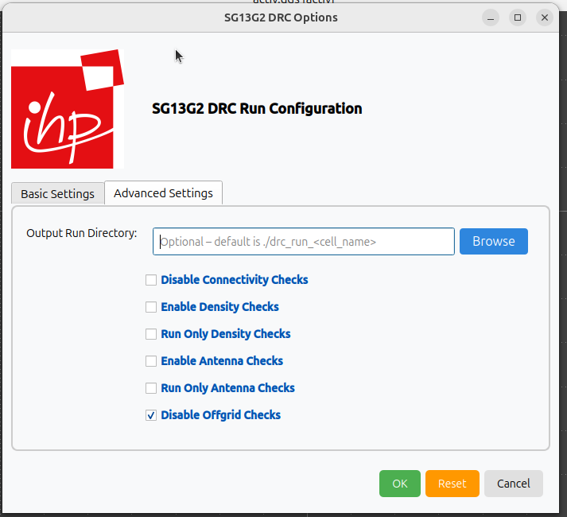

Klayout-DRC
===========

Explains how to use the SG13G2 DRC rule decks.

# Table of contents
- [Klayout-DRC](#klayout-drc)
- [Table of contents](#table-of-contents)
  - [Folder Structure](#folder-structure)
  - [Prerequisites](#prerequisites)
  - [Installation](#installation)
  - [Usage](#usage)
    - [CLI](#cli)
      - [DRC Outputs](#drc-outputs)
    - [GUI](#gui)


## Folder Structure

```text
📁 drc
 ┣ 📁images                         Directory for the SG13G2 DRC images.
 ┣ 📁testing                        Directory for the SG13G2 DRC testing environment.
 ┣ 📁rule_decks                     Contains all DRC rule decks used for SG13G2.
 ┣ 📜README.md                      Documentation for SG13G2 DRC.
 ┗ 📜run_drc.py                     Main Python script for SG13G2 DRC run.
 ```

## Prerequisites

You need the following set of tools installed to be able to run SG13G2 DRC:

- Python 3.9+
- KLayout 0.29.0+

We have tested this using the following setup:
- Python 3.9.18
- KLayout 0.30.1

## Installation

To install the required Python packages, execute the following command in the DRC directory:

```bash
pip install -r ../../../../../requirements.txt
```

## Usage

You have the option to execute the SG13G2-DRC through either a Python script via the command-line interface [CLI](#cli) or by the Klayout graphical user interface [GUI](#gui), as detailed in the subsequent usage sections.

### CLI

The `run_drc.py` script takes your gds to run DRC rule decks with switches to select subsets of all checks.

```bash
    run_drc.py (--help | -h)
    run_drc.py --path=<file_path>
            [--table=<table_name>]... [--mp=<num_cores>] [--run_dir=<run_dir_path>]
            [--topcell=<topcell_name>] [--run_mode=<mode>] [--drc_json=<json_path>]
            [--no_feol] [--no_beol] [--MaxRuleSet] [--no_connectivity] [--no_density]
            [--density_thr=<density_threads>] [--density_only] [--antenna]
            [--antenna_only] [--no_offgrid] [--macro_gen]
```

**Example:**

```bash
    python3 run_drc.py --path=testing/testcases/unit/activ.gds --run_mode=deep --run_dir=test_activ --no_density
```

**Options:**

```bash
  -h, --help            show this help message and exit
  --path PATH           Path to the input GDS file to be processed.
  --table TABLE         DRC table name(s) to execute (e.g., activ, metal1). This option can be used multiple times.
  --mp MP               Number of parts to split the rule deck for parallel execution. [default: 1]
  --run_dir RUN_DIR     Dir to store all run results. If not specified, a timestamped dir under the current path will be used.
  --topcell TOPCELL     Top-level cell name to use from the input GDS.
  --density_thr DENSITY_THR
                        Number of threads to use during the density run (default: number of CPU cores).
  --run_mode {flat,deep}
                        KLayout execution mode: flat, deep, or tiling. [default: deep]
  --drc_json DRC_JSON   Path to a JSON file that defines rule values to use.
  --no_feol             Disable all FEOL-related DRC checks.
  --no_beol             Disable all BEOL-related DRC checks.
  --MaxRuleSet          Force execution of the full rule deck.
  --no_connectivity     Skip connectivity-related rules.
  --no_density          Disable density rule checks.
  --density_only        Run only density rules.
  --antenna             Enable antenna rule checks.
  --antenna_only        Run only antenna rules.
  --no_offgrid          Disable offgrid rule checks.
  --macro_gen           Only generate the DRC rule deck without running.
```

> **ℹ️ Note**  
> By default, the **short rule set** will be executed, which includes **density rules**.  
> To disable density checks, use the `--no_density` switch.
>
> If the `--drc_json=<json_path>` option is **not provided**, the script will follow this fallback order:
>
> 1. Try to load the **SG13G2 tech JSON**:  
>   [SG13G2 tech JSON](../../python/sg13g2_pycell_lib/sg13g2_tech_mod.json)
>
> 2. If not found, fall back to the **default DRC values**:  
>    [default tech DRC values](./rule_decks/default_drc_rules.json)

#### DRC Outputs

You could find the run results at your run directory if you previously specified it through `--run_dir=<run_dir_path>`. Default path of run directory is `drc_run_<date>_<time>` in current directory.

**Folder Structure of run results**

```text
📁 drc_run_<date>_<time>
 ┣ 📜 drc_run_<date>_<time>.log
 ┗ 📜 main.drc
 ┗ 📜 <your_design_name>.lyrdb
 ```

The outcome includes a database (`<your_design_name>.lyrdb`) containing DRC results. You can view it by opening your gds file with: `klayout <device_name>.gds -m <your_design_name>.lyrdb`. Alternatively, you can visualize it on your GDS file using the netlist browser option in the tools menu of the KLayout GUI as illustrated in the following figures.

<p align="center">
  
</p>
<p align="center">
  Fig. 1. Marker Browser for Klayout-DRC
</p>

After selecting Marker Browser option, you could load the database file and visualize the DRC results.

<p align="center">
  
</p>
<p align="center">
  Fig. 2. Loading DRC database file - 1
</p>

<p align="center">
  
</p>
<p align="center">
  Fig. 3. Loading DRC database file - 2
</p>

<p align="center">
  
</p>
<p align="center">
  Fig. 4. Visualize DRC results
</p>

### GUI

The SG13G2 also facilitates DRC execution via Klayout menus as depicted below:

First, you need to add the DRC menus to your `KLAYOUT_PATH`, you could do that by executing the following command:

```bash
KLAYOUT_PATH=$PDKPATH/libs.tech/klayout:$PDKPATH/libs.tech/klayout/tech/ klayout -e
```

> **_NOTE:_** In this context, `PDKPATH` refers to the path leading to the IHP-Open-PDK/ihp-sg13g2 directory within the current repository.

Then, you will get the DRC menus for SG13G2, you could set your desired options as shown below:

<p align="center">
  
</p>
<p align="center">
  Fig. 5. Setting up DRC Options-GUI - 1
</p>

<p align="center">
  
</p>
<p align="center">
  Fig. 6. Setting up DRC Options-GUI - 2
</p>

<p align="center">
  
</p>
<p align="center">
  Fig. 7. Setting up DRC Options-GUI - 3
</p>

For additional details on GUI options, please refer to the [CLI Options section](#cli).

Finally, after setting your option, you could execute the DRC using `Run Klayout DRC` from the dropdown menu.

<p align="center">
  
</p>
<p align="center">
  Fig. 8. Running DRC using Klayout menus
</p>

Upon executing the DRC, the result database will appear on your layout interface, allowing you to verify the outcome of the run.

<p align="center">
  
</p>
<p align="center">
  Fig. 9. Running DRC using Klayout menus
</p>

---
**NOTE**

The current SG13G2 DRC rules are categorized as follows:

- **Minimum Rule Set** – Refer to the [README](docs/MinList.md):  
  This set contains the essential DRC rules that are required for baseline verification. All rules in this category have been thoroughly verified, tested, and optimized for performance.

- **Maximum Rule Set** – Refer to the [README](docs/MaxList.md):  
  This set includes additional residual rules that are not part of the minimum set. These rules can be activated by using the `--MaxRuleSet` switch when executing the DRC. Please note that these rules have not been verified or tested.

- **Missing Rule Set** – Refer to the [README](docs/MissingList.md):  
  This set lists the DRC rules that have not yet been implemented.
---
