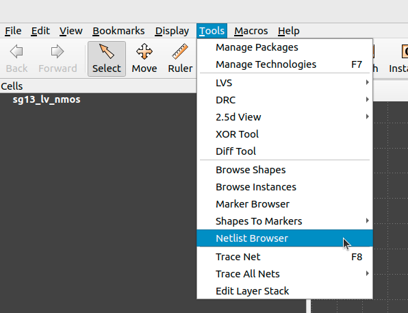
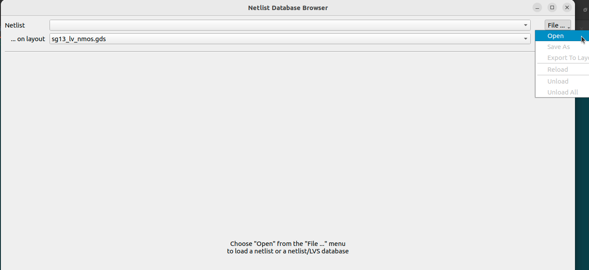
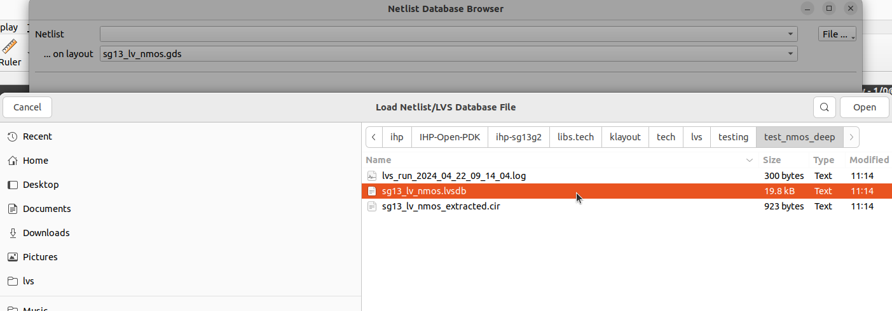
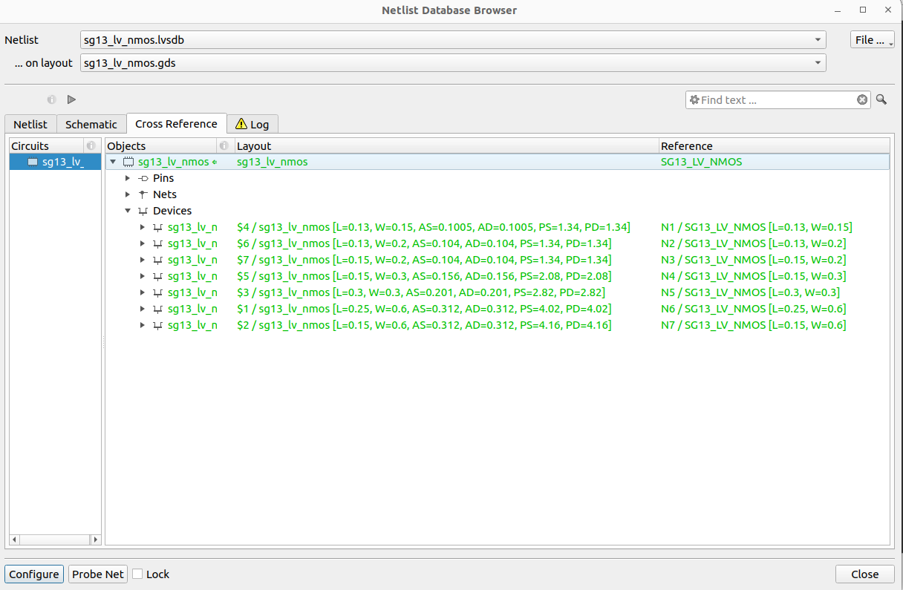

# SG13G2 LVS Testing

Explains how to test SG13G2 LVS rule decks.

## Folder Structure

```text
📁 testing
 ┣ 📜README.md              This file to document the testing directory.
 ┣ 📜Makefile               Used for SG13G2 LVS rule deck testing.
 ┣ 📜run_regression.py      Main regression script used for LVS testing.
 ┣ 📁testcases              All testcases used for LVS testing.
 ```

## Prerequisites

At a minimum:

You need the following set of tools installed to be able to run the regression:
- Python 3.9+
- KLayout 0.28.14+

We have tested this using the following setup:
- Python 3.9.18
- KLayout 0.28.16

## Installation

To install the required Python packages, execute the following command:

```bash
pip install -r ../../../../../../requirements.txt
```

## Usage

```bash
    run_regression.py (--help| -h)
    run_regression.py [--device=<device>] [--run_dir=<run_dir_path>] [--mp=<num>]
```

Example:

```bash
    python3 run_regression.py --device_name=MOS --run_dir=test_mos
```

### Options

- `--help -h`                  Print this help message.
    
- `--device=<device>`          Select device category you want to run regression on.

- `--run_dir=<run_dir_path>`   Run directory to save all the results [default: pwd]

- `--mp=<num>`                 The number of threads used in run.


Another approach for testing LVS devices, you could make a full test for SG13G2 LVS rule deck, by executing the following command in current testing directory:

```bash
make all
```

## LVS Outputs

You could find the regression run results at your run directory if you previously specified it through `--run_name=<run_name>`. Default path of run directory is `unit_tests_<date>_<time>` in the current testing directory.

### Folder Structure of regression run results

```text
📁 unit_tests_<date>_<time>
 ┣ 📜 unit_tests_<date>_<time>.log
 ┣ 📜 all_test_cases_results.csv
 ┗ 📜 rule_deck_rules.csv
 ┗ 📁 <device_name>
    ┣ 📜 <device_name>_lvs.log
    ┣ 📜 <device_name>.gds
    ┣ 📜 <device_name>.cdl
    ┣ 📜 <device_name>_extracted.cir                     
    ┣ 📜 <device_name>.lvsdb
 ```

The outcome includes a database file for each device (`<device_name>.lvsdb`) containing LVS extractions and comparison results. You can view it by opening your gds file with: `klayout <device_name>.gds -mn <device_name>.lvsdb`. Alternatively, you can visualize it on your GDS file using the netlist browser option in the tools menu of the KLayout GUI as illustrated in the following figures.

<p align="center">
  
</p>
<p align="center">
  Fig. 1. Netlist Browser for Klayout-LVS
</p>

After selecting Netlist Browser option, you could load the database file and visualize the LVS results.

<p align="center">
  
</p>
<p align="center">
  Fig. 2. Loading LVS Netlist/database file - 1
</p>

<p align="center">
  
</p>
<p align="center">
  Fig. 3. Loading LVS Netlist/database file - 2
</p>

<p align="center">
  
</p>
<p align="center">
  Fig. 4. Visualize LVS results
</p>

Additionally, you can find the extracted netlist generated from your design at (`<device_name>_extracted.cir`) in the output run directory.
