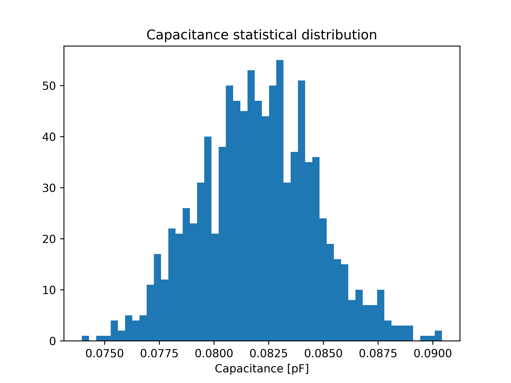
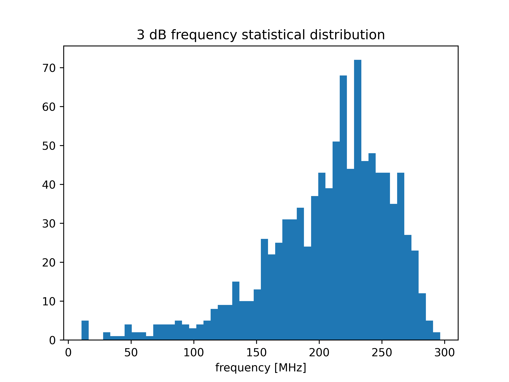
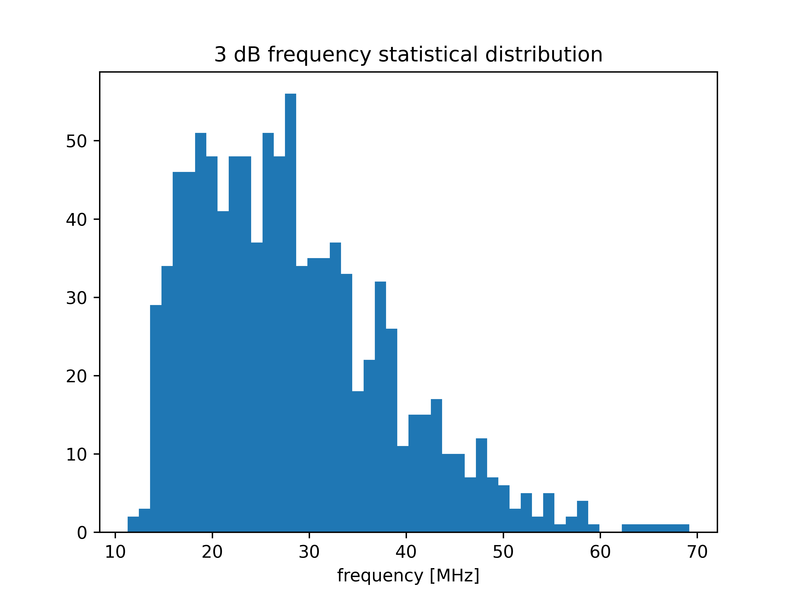
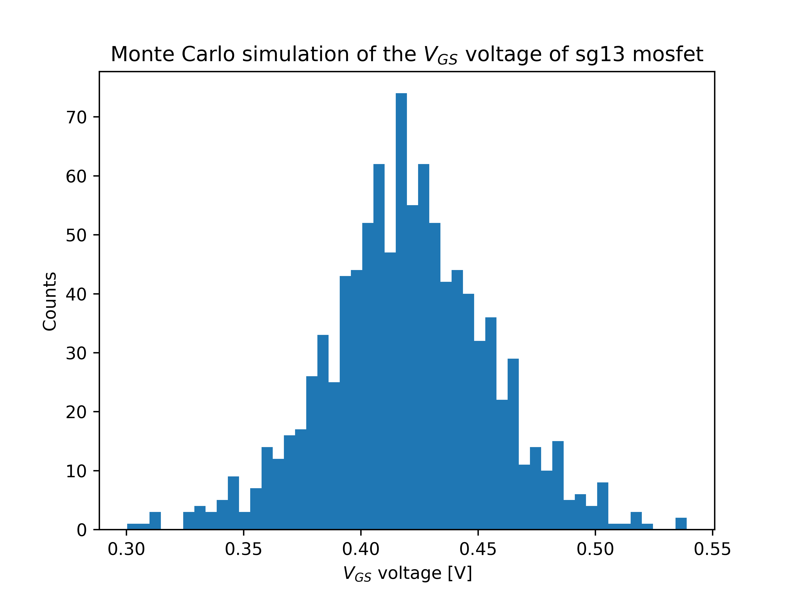
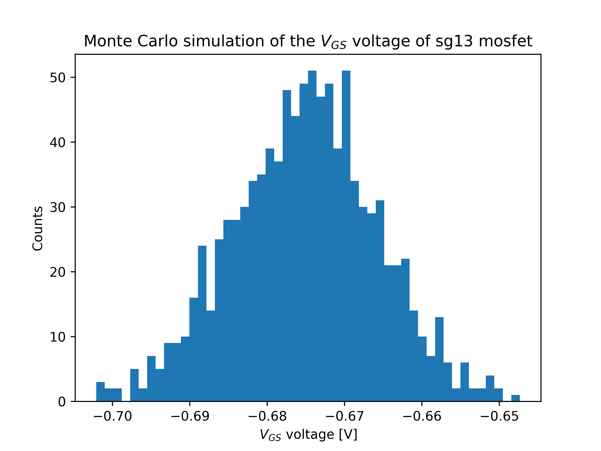

# Test circuits description

The test circuits are organized by simulation type and shown in the table below:

| File name                  | Description                                           |
|--------------------------- |  -----------------------------------------------------|
| IHP_testcases.sch          | The top level schematic                               |
| dc_lv_nmos.sch             | DC simulation of low voltage nmos transistor, the simulation can perform both: (1) DC operational point and (2) dc parametric sweep in order obtain a family of the output characteristics |
| dc_lv_pmos.sch             | DC simulation of low voltage pmos transistor, the simulation can perform both: (1) DC operational point and (2) dc parametric sweep in order obtain a family of the output characteristics |
| dc_hv_nmos.sch             | DC simulation of high voltage nmos transistor, the simulation can perform both: (1) DC operational point and (2) dc parametric sweep in order obtain a family of the output characteristics |
| dc_hv_pmos.sch             | DC simulation of high voltage pmos transistor, the simulation can perform both: (1) DC operational point and (2) dc parametric sweep in order obtain a family of the output characteristics |
| dc_mos_temp.sch            | Temperature sweep from -40 to 125 of four versions of the mos transistors polarized using constant voltage sources $V_{DS}=1.5$ and $V_{GS}=0.75$. The output drain currents  $I_{D}$ are dumped into a CSV file in the following order: NMOSLV, NMOSHV, PMOSLV, PMOSHV |
| dc_mos_cs_temp.sch         | Temperature sweep from -40 to 125 of four versions of the mos transistors polarized using constant current source $I_{D}=10\mu$ and shorted gate and drain terminals. The output  $V_{GS}$ voltages are dumped into a CSV file in the following order: NMOSLV, NMOSHV, PMOSLV, PMOSHV |
| tran_mim_cap.sch           | Transient simulation of a MiM capacitor using current source and reference capacitor model |
| ac_nmosrf.sch              | A frequency sweep of a Common Source amplifier in two configurations: (1) with rfmode=0 and (2) with rfmode=1. The testcase measures also the output voltage magnitude at 5 GHz using .meas command|
| ac_mimcap.sch              | MiM cap frequency sweep and measurement of -3dB cut-off frequency  |
| mc_lv_nmos_cs_loop.sch     | The Monte Carlo operating point ($V_{GS}$) simulations of low voltage nmos transistor polarized using current source 
| mc_hv_nmos_cs_loop.sch     | The Monte Carlo operating point ($V_{GS}$) simulations of high voltage nmos transistor polarized using current source 
| mc_lv_pmos_cs_loop.sch     | The Monte Carlo operating point ($V_{GS}$) simulations of low voltage pmos transistor polarized using current source 
| mc_hv_pmos_cs_loop.sch     | The Monte Carlo operating point ($V_{GS}$) simulations of high voltage pmos transistor polarized using current source 
| mc_res_op.sch              | The Monte Carlo simulation of three types of resistors: $R_{sil}$, $R_{ppd}$ and $R_{high}$. Three corners available: res_typ, res_bcs, res_wcs.   |
| mc_hbt_13g2.sch            | The Monte Carlo operating point simulation HBT sg13g2(l,v) transistor in a common emitter amplifier configuration. Three corners available: res_typ, res_bcs, res_wcs.   |
| mc_hbt_13g2_ac.sch         | The Monte Carlo AC simulation HBT sg13g2(l,v) transistor. Measurements of -3dB cut-off frequency. Three corners available: hbt_typ, hbt_bcs, hbt_wcs.   |
| mc_mim_cap_ac.sch          | The Monte Carlo AC simulation MiM capacitor (also Cparasitic, or rfmim). Measurements of -3dB cut-off frequency. Three corners available: hbt_typ, hbt_bcs, hbt_wcs.   |
| sp_mim_cap.sch             | The S-parameters  simulation of a  MiM capacitor. Measurements of capacitance and series resistance. Three corners available: cap_typ, cap_bcs, cap_wcs.   |
| sp_parasitic_cap.sch       | The S-parameters  simulation of a parasitic capacitor. Measurements of capacitance and series resistance.  Measurements of -3dB cut-off frequency. Three corners available: cap_typ, cap_bcs, cap_wcs.   |
| sp_rfmim_cap.sch           | The S-parameters  simulation of a rfmim capacitor. Measurements of capacitance and series resistance. Three corners available: cap_typ, cap_bcs, cap_wcs.   |

## Python post processing scripts

Since the data from MC analysis are exported into a CSV file some python scripts are provided in order to post process 
and visualize the data (usually in a form of a histogram). 
The common use of a scrip is 

`python3 script_name.py  ../csv/file_name.csv`

The following table describes the purpose of each script. 

| Script name                | Description                                           |
|--------------------------- |  -----------------------------------------------------|
| MC_mos.py                  | Reports mean and std and plots the $V_{GS}$ histogram  using data form `mc_xx_ymos_cs.csv`. The generated plot is saved into a png file 
| MC_res.py                  | Reports mean and std and plots the $R_{sil}$, $R_{ppd}$, $R_{high}$ histograms using data form `mc_res_op.csv`. The generated plot is saved into a png file 
| MC_mim_cap.py              | Reports mean and std and plots MiM capacitor histograms using data form `mc_cmim.csv`. The generated plot is saved into a png file 
| MC_hbt_3dB.py              | Reports mean and std and plots 3dB cut-off frequency histograms using data form `mc_hbt_3dB.csv`. The generated plot issaved into a png file `mc_hbt_3dB.csv.png` 

## Results

Example MC simulation results for a 10u x 10u MiM capacitor.
|Best case|Typ case|Worst case|
|--|--|--|
| |  |  |

Example MC simulation $f_{3dB}$ results for a HBT based common emitter amplifier .
|Best case|Typ case|Worst case|
|--|--|--|
| |  |  |

Example MC simulation targeting $V_{GS}$ of a NMOS transistor polarized using current source.
|Low voltage|High voltage|
|--|--|
| |  |

Example MC simulation targeting $V_{GS}$ of a PMOS transistor polarized using current source.
|Low voltage|High voltage|
|--|--|
| |  |
